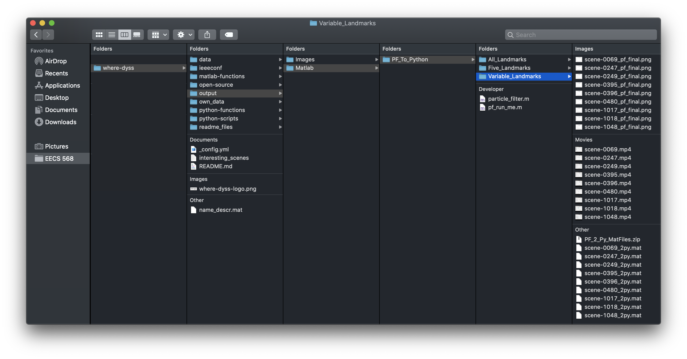
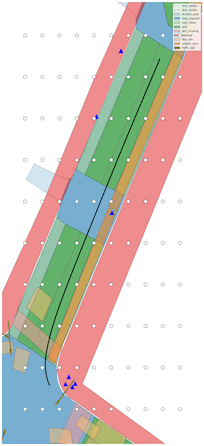

## Welcome to our project page!

We are Where DYSS (Ford Team No. 1) and this is our project page for Mobile Robotics (EECS 568).

### Team members:

* Arnav Sharma (arnavsha@umich.edu)
* Benjamin Dion (bedion@umich.edu)
* Eric Yu (ericyu@umich.edu)
* Saurabh Sinha (sinhasau@umich.edu)

### Course link:

[Mobile Robotics](http://robots.engin.umich.edu/mobilerobotics/)

### Project Information

### Dependencies
There are quite a few libraries needed for the project code to run. The most important dependency (NuScenes, NuScenesMap, etc.) is explained in */where-dyss/readme_files/dataREADME.md*.

The other ones include:
* numpy
* matplotlib
* h5py
* math
* scipy
* os
* sys
* pickle
* pandas
* warnings
* time

### Step-by-step Instructions
1. Read and complete all steps listed in */where-dyss/readme_files/dataREADME.md*. It is very crucial that the resulting folder structure be exactly how it is stated in that README file.
2. Git clone this project! `git clone https://github.com/arnavsharma/where-dyss.git`
2. Running the Particle Filter code
    1. Make sure to read the */where-dyss/readme_files/pfREADME.md* file to get an idea of how the particle filter works.
    2. Skip to Step 10 if you want to just visualize the 'scene-0249' data the group presented at the end of the Winter 2020 semester in Python.
    3. The following code in Step 2.iv will be run in a *normal* terminal window (not in a Python3 terminal). The starting directory will be */where-dyss/python-scripts*. Step 2.iv may take some time to run, so please be patient
    4. `python3 pf_data_to_matlab.py`
        1. This will save the landmarks (annotations) position and ego vehicle position among other housekeeping items such as number of samples per scene, number of annotations per sample per scene, etc.
        2. The resulting .mat files will be saved in */where-dyss/python-scripts*. Please move them to */where-dyss/own_data/PF_To_Matlab/Variable_Landmarks*.
    5. Open an instance of Matlab and navigate the current directory to */where-dyss/output/Matlab/PF_To_Python*. The .m files here (pf_run_me.m and particle_filter.m) will simulate the particle filter.
    6. If you would like to not save an MP4 video of the particles being propagated and corrected **and** a JPG of the final estimated states path on top of ego_pose (ground truth), set `want_videos_jpg` to `0` in Line 22 of *pf_run_me.m*. Leave it set to `1` if you want to save MP4 videos of each scene. The videos and images will be saved in this directory. Kindly move them one level down into *Variable_Landmarks* folder.
    7. If you would like to not save the .mat files for animation purposes in Python, set `want_mat_files` to `0` in Line 23 of *pf_run_me.m*. Leave it set to `1` if you want to save .mat files for each scene. As in the previous step, please kindly move the .mat files one level down into *Variable_Landmarks* folder.
    8. The resulting directory if both save options are set to `1` will look like the following:
        
        
        
    9. Now that the data has been saved, we can visualize it in Python!
    10. In a new Terminal window, navigate to */where-dyss/python-functions/* directory and start a python3 terminal session by running `python3`.
    11. Run `exec(open("pf_fancy_map_img_creation.py).read())`
    12. Then run `pf_fancy_map_img_creation()`
        1. In the start, the script will take a bit of time to run as it is indexing and reverse indexing the NuScenes data.
        2. Once indexing is complete, it will prompt you to enter in a scene number string (i.e. scene-0249). And then it'll start evaluating the scene!
        3. The .png images needed for a GIF animation will be saved in */where-dyss/output/Images/PF/*
    13. Navigate to the */where-dyss/output/Images/PF/* directory in a normal Terminal session, and run the following in `convert -delay 50 -loop 0 <scene-entrystring_here>*.png <scene-entrystring_here>.gif` where `scene-entrystring_here` is for example 'scene-0249' without quotes. This will create a GIF of the data!
    14. Here is a GIF of the result!
    
        
